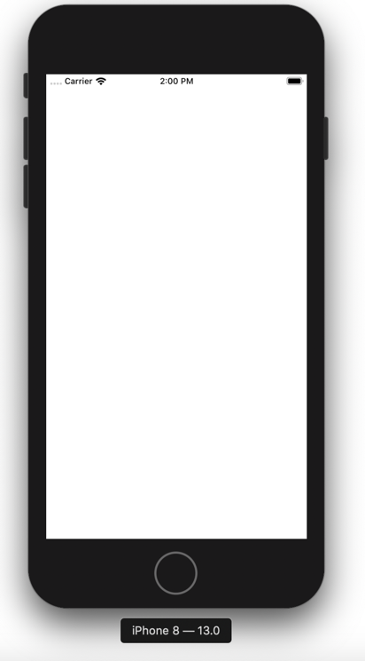
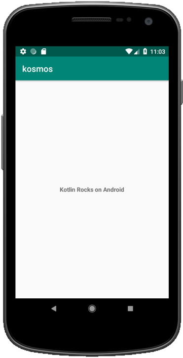
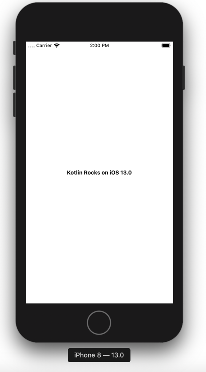
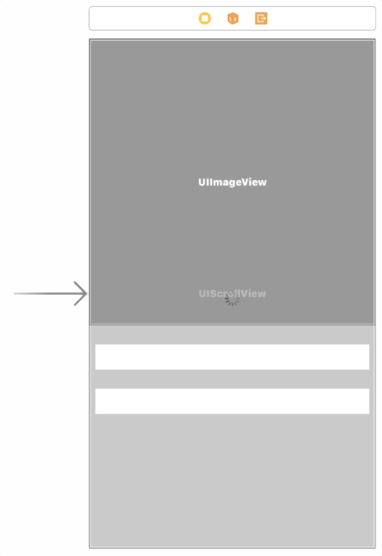
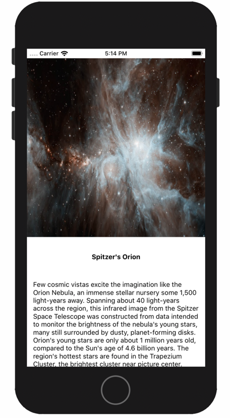

author: Maxime LUMEAU, Robin CAROFF and Pierre TIBULLE
summary: Kotlin Multiplatform Workshop
id: codelab-kotlin-multiplatform
categories: codelab,kotlin
environments: Web
status: Draft
feedback link: https://github.com/RobinCaroff/workshop-kmp
analytics account: ???

# Workshop Kotlin Multiplatform

## CodeLab Overview
Duration: 0:02:00

#### Sharing Kotlin code between iOS and Android 

In this codelab you will create an iOS and Android application, by making use of Kotlin's code sharing features. 
For Android you'll be using Kotlin/JVM, while for iOS it will be Kotlin/Native.

This codelab will show you the ability to share code within Kotlin and the benefits it provides. While what we'll be looking at is a simplified application, what is shown here can be applied to real world applications, independent of their size or complexity.

You will learn how to:

#### Create an Android app with Android Studio
#### Create a shared Kotlin library
* Use it from Android app
* Start the Android application

#### Create an iOS app with Xcode
* Use the shared Kotlin library from iOS app
* Use Kotlin from Swift
* Start the iOS application

#### Improve the shared library
* Use Coroutines to validate the asynchronous ability
* Use the multiplatform Http client Ktor to call a Json Api 

Positive
: This codelab is inspired by the Jetbrains [tutorial](https://kotlinlang.org/docs/tutorials/native/mpp-ios-android.html) for the first steps

## Environment Setup
Duration: 0:04:00

You need [Android Studio](https://developer.android.com/studio/) 3.4+ for the Android part of the tutorial. 

Negative
: ⚠️ Kotlin MPP is broken with 3.5.1. Please use 3.5.0 or 3.6 preview releases ⚠️

Positive
: You can also use [IntelliJ IDEA](https://jetbrains.com/idea/) Community or Ultimate edition.

The Kotlin plugin 1.3.41 or higher should be installed in the IDE. This can be verified via Language & Frameworks | Kotlin Updates section in the Settings (or Preferences) window.

For the iOS part of the tutorial, you need a macOS 10.14+ host with Xcode 10.3+ and the tools installed and configured.

Negative
: If you don't fill in the requirements at least for the Android part, please consider pair programming !!!

## STEP ONE - Initialize the project
Duration: 0:10:00

#### In this step, we check that everything is well configured !

Clone the workshop project repository : 
``` bash
git clone https://github.com/mlumeau/workshop-kmp.git
```

Checkout the branch `step_one_setup` : 
``` bash
cd workshop-kmp
git checkout step_one_setup
```

This project contain an Android app, a library and an iOS project.

#### Launch the Android Studio IDE and open the project.

The project should sync and you should be able to compile and run the Android application on an emulator or a real device. 

#### Let's check that it works!
You should see a blank screen :


Positive
: In the project, you can see the kore module which will contain the code for the multiplatform Android/iOS library.

#### For Mac users :
First you have to prepare the framework for iOS

``` bash
./gradlew :kore:packForXCode 
```

It creates the directory `kore/build/xcode-frameworks` which contains a gradlew executable and the framework for Xcode.

Now install the pods :
``` bash
cd iosApp/kosmos
pod install
```

Negative
: In case of errors, try to reinstall pods with the last version of cocoapods

``` bash
sudo gem install cocoapods
pod deintegrate
rm Podfile.lock
pod install
```

#### Now you can open the project in Xcode
by opening the workspace file : `../workshop-kmp/iosApp/kosmos/kosmos.xcworkspace`

You can now compile and run the project on an iOS emulator or on a real device.

You should see a blank screen :


#### If everything's fine, let's go to the second step !!!

## STEP TWO - A very basic KMP project
Duration: 0:12:00

#### In this step, you will implement your first multiplatform code !

The goal of this step is to define a common method which creates a greetings text and adds spécific implementations for iOS and Android in the Kotlin common code.

As a result, we will creates an Android module and an iOS framework both exposing the same method `createApplicationScreenMessage` but having different implementation.

First add this code in the common directory : `kore/src/commonMain/kotlin/xyz/mlumeau/kosmos/kore/common.kt`

``` Kotlin
package xyz.mlumeau.kosmos.kore

expect fun platformName(): String

fun createApplicationScreenMessage(): String {
    return "Kotlin Rocks on ${platformName()}"
}
```

Positive
: The keyword `expect` means that you have to implement these function in the specific code (the `actual` code).

Now edit the android directory : `workshop-kmp/kore/src/androidMain/kotlin/xyz/mlumeau/kosmos/kore/actual.kt`

``` Kotlin
package xyz.mlumeau.kosmos.kore

actual fun platformName(): String {
    return "Android"
}
```

Positive
: The keyword `actual` corresponds to the `expect` in the specific code.

In the Android main project "androidApp", update the MainActivity :

Add a TextView in `res/layout/activity_main.xml`

``` XML
<?xml version="1.0" encoding="utf-8"?>

<RelativeLayout xmlns:android="http://schemas.android.com/apk/res/android"
        xmlns:tools="http://schemas.android.com/tools"
        android:layout_width="match_parent"
        android:layout_height="match_parent"
        tools:context=".views.MainActivity">

    <TextView
            android:id="@+id/title_tv"
            android:textStyle="bold"
            android:layout_width="wrap_content"
            android:layout_height="wrap_content"
            android:layout_centerInParent="true" />

</RelativeLayout>
```

Handle this textview in `java/xyz.mlumeau.kosmos.views/MainActivity` (Kotlin file)

``` Kotlin
package xyz.mlumeau.kosmos.views

import android.os.Bundle
import androidx.appcompat.app.AppCompatActivity
import kotlinx.android.synthetic.main.activity_main.*
import xyz.mlumeau.kosmos.R
import xyz.mlumeau.kosmos.kore.createApplicationScreenMessage

class MainActivity : AppCompatActivity() {

    override fun onCreate(savedInstanceState: Bundle?) {
        super.onCreate(savedInstanceState)
        setContentView(R.layout.activity_main)
        title_tv.text = createApplicationScreenMessage()
    }
}
```

Run it and you should see :


#### For Mac users :

Now edit the iOS directory : `workshop-kmp/kore/src/iosMain/kotlin/xyz/mlumeau/kosmos/kore/actual.kt`

``` Kotlin
package xyz.mlumeau.kosmos.kore

import platform.UIKit.UIDevice

actual fun platformName(): String {
    return UIDevice.currentDevice.systemName() +
            " " +
            UIDevice.currentDevice.systemVersion
}
```

Back to Xcode !

If you are familiar with Storyboard, add a "titleTV" TextView in the center of the MainView and set the  reference to the MainViewController.titleTV @IBOutlet.
If you prefer, download the [storyboard from the next step](https://github.com/mlumeau/workshop-kmp/blob/step_three_localrepository/iosApp/kosmos/kosmos/Base.lproj/Main.storyboard).

And then update the MainViewController to handle the "titleTV" textView

``` Swift
import UIKit
import Nuke
import kore

class MainViewController: UIViewController {
    
    @IBOutlet weak var titleTV: UITextView!
    
    override func viewDidLoad() {
        super.viewDidLoad()
        self.titleTV.text = CommonKt.createApplicationScreenMessage()
    }

    override var preferredStatusBarStyle: UIStatusBarStyle {
        return self.style
    }
    var style:UIStatusBarStyle = .default
}

```

You can now compile and run the project on an iOS emulator or on a real device.


#### If everything's fine, let's go to the step 3 !!!

## STEP THREE - Local Repository
Duration: 0:20:00

#### In this step, you will implement a local repository to simulate a call to the Nasa API APOD - "Astronomy Picture Of the Day" !

First create a common Model : `kore/src/commonMain/kotlin/xyz/mlumeau/kosmos/kore/model/APOD.kt`

``` Kotlin
package xyz.mlumeau.kosmos.kore.model

import kotlinx.serialization.Optional
import kotlinx.serialization.Serializable

@Serializable
data class APOD(
    @Optional val explanation: String? = null,
    @Optional val media_type: String? = null,
    @Optional val title : String? = null,
    @Optional val url: String? = null
)
```
Now the repository cache interface : `.../kore/data/APODRepositoryCache.kt`

``` Kotlin
package xyz.mlumeau.kosmos.kore.data

import xyz.mlumeau.kosmos.kore.model.APOD

interface APODRepositoryCache {
    suspend fun getAPOD(): APOD?
    fun getAPOD(completion: (APOD) -> Unit, failure: () -> Unit)
}
```

Notice that we create to methods with the same purpose.

Positive
: The `suspend` keyword is not supported in Swift. As we are going to take advantage of coroutines, the Android app will call the `suspend` method but the iOS one will call the regular method with a callback system.

And the implementation : `.../kore/data/APODRepositoryCacheImpl.kt` which contains the APOD stub in its companion object.

``` Kotlin
package xyz.mlumeau.kosmos.kore.data

import kotlinx.serialization.json.Json
import xyz.mlumeau.kosmos.kore.model.APOD
import xyz.mlumeau.kosmos.kore.requestAPOD

class APODRepositoryCacheImpl : APODRepositoryCache {

    override suspend fun getAPOD(): APOD? = Json.nonstrict.parse(APOD.serializer(), APOD_STUB)

    override fun getAPOD(completion: (APOD) -> Unit, failure: () -> Unit) {
        requestAPOD(this, completion, failure)
    }

    companion object {
        private const val APOD_STUB =
            "{\"date\":\"2019-08-31\",\"explanation\":\"Few cosmic vistas excite the imagination like the Orion Nebula, an immense stellar nursery some 1,500 light-years away. Spanning about 40 light-years across the region, this infrared image from the Spitzer Space Telescope was constructed from data intended to monitor the brightness of the nebula's young stars, many still surrounded by dusty, planet-forming disks. Orion's young stars are only about 1 million years old, compared to the Sun's age of 4.6 billion years. The region's hottest stars are found in the Trapezium Cluster, the brightest cluster near picture center. Launched into orbit around the Sun on August 25, 2003 Spitzer's liquid helium coolant ran out in May 2009. The infrared space telescope continues to operate though, its mission scheduled to end on January 30, 2020. Recorded in 2010, this false color view is from two channels that still remain sensitive to infrared light at Spitzer's warmer operating temperatures.\",\"hdurl\":\"https://apod.nasa.gov/apod/image/1908/orion2010_spitzer.jpg\",\"media_type\":\"image\",\"service_version\":\"v1\",\"title\":\"Spitzer's Orion\",\"url\":\"https://apod.nasa.gov/apod/image/1908/orion2010_spitzerMedRC.jpg\"}"
    }
}
```

Update the common file : `.../kore/common.kt`

``` Kotlin
package xyz.mlumeau.kosmos.kore

import xyz.mlumeau.kosmos.kore.data.APODRepositoryCacheImpl


expect fun platformName(): String

fun createApplicationScreenMessage(): String {
    return "Kotlin Rocks on ${platformName()}"
}

internal fun helloCoroutine() {
    println("Hello Coroutines!")
}

expect fun requestAPOD(
    apodRepositoryCache: APODRepositoryCacheImpl,
    completion: (APOD) -> Unit,
    failure: () -> Unit
)
```

Now edit the android directory : `workshop-kmp/kore/src/androidMain/kotlin/xyz/mlumeau/kosmos/kore/actual.kt`

``` Kotlin
package xyz.mlumeau.kosmos.kore

import xyz.mlumeau.kosmos.kore.data.APODRepositoryCacheImpl

actual fun platformName(): String {
    return "Android"
}

actual fun requestAPOD(
    apodRepositoryCache: APODRepositoryCacheImpl,
    completion: (APOD) -> Unit,
    failure: () -> Unit
) {
    TODO("The Android app must use the suspend function instead.")
}
```

Now that we have a data model and a repository to provide it, we will create the user interface to display the data content.

Let's start with the Android application. In the Android main project "androidApp", update the MainActivity :

Remove the TextView and add an Image, a title, a text and a progressbar in `res/layout/activity_main.xml`

``` XML
<?xml version="1.0" encoding="utf-8"?>

<RelativeLayout
        xmlns:android="http://schemas.android.com/apk/res/android"
        xmlns:tools="http://schemas.android.com/tools"
        xmlns:app="http://schemas.android.com/apk/res-auto"
        android:layout_width="match_parent"
        android:layout_height="match_parent"
        tools:context=".views.MainActivity">
    <ScrollView android:layout_width="match_parent" android:layout_height="wrap_content">
        <androidx.constraintlayout.widget.ConstraintLayout
                android:layout_width="match_parent"
                android:layout_height="wrap_content"
                android:paddingBottom="16dp">

            <ImageView android:id="@+id/apod_iv"
                       android:layout_width="match_parent"
                       android:layout_height="0dp"
                       android:scaleType="centerCrop"
                       app:layout_constraintDimensionRatio="1:1"
                       app:layout_constraintTop_toTopOf="parent"
                       android:contentDescription="@string/astronomy_picture_of_the_day"/>

            <TextView
                    android:id="@+id/title_tv"
                    android:textStyle="bold"
                    android:layout_width="wrap_content"
                    android:layout_height="wrap_content"
                    app:layout_constraintLeft_toLeftOf="parent"
                    app:layout_constraintRight_toRightOf="parent"
                    android:layout_marginTop="32dp" app:layout_constraintTop_toBottomOf="@+id/apod_iv"
                    android:layout_marginLeft="16dp" android:layout_marginRight="16dp"/>
            <TextView
                    android:id="@+id/desc_tv"
                    android:layout_width="0dp"
                    android:layout_height="wrap_content"
                    android:ellipsize="end"
                    app:layout_constraintLeft_toLeftOf="parent"
                    app:layout_constraintRight_toRightOf="parent"
                    app:layout_constraintStart_toStartOf="parent" android:layout_marginStart="16dp"
                    app:layout_constraintEnd_toEndOf="parent" android:layout_marginEnd="16dp"
                    android:layout_marginTop="16dp"
                    app:layout_constraintTop_toBottomOf="@+id/title_tv"/>

        </androidx.constraintlayout.widget.ConstraintLayout>
    </ScrollView>

    <ProgressBar
            android:id="@+id/progress"
            android:indeterminate="true"
            android:layout_width="wrap_content" android:layout_height="wrap_content"
            app:layout_constraintEnd_toEndOf="parent" android:layout_marginEnd="8dp"
            android:layout_centerInParent="true"
            />

</RelativeLayout>
```

Handle these views in `java/xyz.mlumeau.kosmos.views/MainActivity` (Kotlin file)

``` Kotlin
package xyz.mlumeau.kosmos.views

import android.os.Bundle
import android.view.View
import androidx.appcompat.app.AppCompatActivity
import com.squareup.picasso.Picasso
import kotlinx.android.synthetic.main.activity_main.*
import kotlinx.coroutines.Dispatchers
import kotlinx.coroutines.GlobalScope
import kotlinx.coroutines.launch
import kotlinx.coroutines.withContext
import xyz.mlumeau.kosmos.R
import xyz.mlumeau.kosmos.kore.model.APOD
import xyz.mlumeau.kosmos.kore.createApplicationScreenMessage
import xyz.mlumeau.kosmos.kore.data.APODRepositoryCache
import xyz.mlumeau.kosmos.kore.data.APODRepositoryCacheImpl

class MainActivity : AppCompatActivity() {

    private val apodRepository: APODRepositoryCache = APODRepositoryCacheImpl()

    override fun onCreate(savedInstanceState: Bundle?) {
        super.onCreate(savedInstanceState)
        setContentView(R.layout.activity_main)
        title_tv.text = createApplicationScreenMessage()

        getAPOD()
    }

    private fun updateAPODData(apod: APOD) {
        title_tv.text = apod.title
        desc_tv.text = apod.explanation
        if (apod.media_type == "image" && !apod.url.isNullOrEmpty()) {
            Picasso.get().load(apod.url).fit().centerCrop().into(apod_iv)
        } else {
            apod_iv.visibility = View.GONE
        }
        progress.visibility = View.GONE
    }

    private fun getAPOD() {
        GlobalScope.launch {
            apodRepository.getAPOD()?.let { apod ->
                withContext(Dispatchers.Main) {
                    updateAPODData(apod)
                }
            }
        }
    }
}
```

Run it and you should see :


#### For Mac users :

We will now create the user interface for the iOS application.

Now edit the iOS directory by creating a "dispatchers" file : `workshop-kmp/kore/src/iosMain/kotlin/xyz/mlumeau/kosmos/kore/dispatchers.kt`

``` Kotlin
package xyz.mlumeau.kosmos.kore

import kotlinx.coroutines.CoroutineDispatcher
import kotlinx.coroutines.CoroutineScope
import kotlinx.coroutines.Job
import kotlinx.coroutines.Runnable
import platform.darwin.dispatch_async
import platform.darwin.dispatch_get_main_queue
import kotlin.coroutines.CoroutineContext


internal class MainDispatcher: CoroutineDispatcher() {
    override fun dispatch(context: CoroutineContext, block: Runnable) {
        dispatch_async(dispatch_get_main_queue()) {
            block.run()
        }
    }
}

internal abstract class Scope(
    private val dispatcher: CoroutineDispatcher
) : CoroutineScope {
    private val job = Job()

    override val coroutineContext: CoroutineContext
        get() = dispatcher + job

}

internal class MainScope : Scope(MainDispatcher())
```
Positive
: On iOS, we need to create a dispatcher that will handle our coroutine on the main dispatch queue. Notice that we use the dispatch_async() and dispatch_get_main_queue() functions that should sound familiar if you have worked with the Grand Central Dispatch on iOS before.  

Now edit the iOS actual file : `workshop-kmp/kore/src/iosMain/kotlin/xyz/mlumeau/kosmos/kore/actual.kt`

``` Kotlin
package xyz.mlumeau.kosmos.kore

import kotlinx.coroutines.launch
import platform.UIKit.UIDevice
import xyz.mlumeau.kosmos.kore.data.APODRepositoryCacheImpl

actual fun platformName(): String {
    return UIDevice.currentDevice.systemName() +
            " " +
            UIDevice.currentDevice.systemVersion
}

fun showHelloCoroutine() {
    MainScope().launch {
        helloCoroutine()
    }
}

actual fun requestAPOD(
    apodRepositoryCache: APODRepositoryCacheImpl,
    completion: (APOD) -> Unit,
    failure: () -> Unit
) {
    MainScope().launch {
        val apod = apodRepositoryCache.getAPOD()
        if (apod != null) {
            completion(apod)
        } else {
            failure()
        }
    }
}
```

Back to Xcode !

If you are familiar with Storyboard, add the progressbar, UIImageView and another textview for description in the MainView (see picture below) and add references to the MainViewController.

If you prefer, download the [storyboard from the next step](https://github.com/mlumeau/workshop-kmp/blob/step_four_remoterepository/iosApp/kosmos/kosmos/Base.lproj/Main.storyboard).

And then update the `MainViewController` code...

``` Swift
import UIKit
import Nuke
import kore

class MainViewController: UIViewController {

    @IBOutlet weak var apodIV: UIImageView!
    @IBOutlet weak var titleTV: UITextView!
    @IBOutlet weak var descTV: UITextView!
    @IBOutlet weak var progress: UIActivityIndicatorView!
    
    private let apodRepository: APODRepositoryCache = APODRepositoryCacheImpl()
    
    override func viewDidLoad() {
        super.viewDidLoad()
        startLoadingData()
    }
    
    override var preferredStatusBarStyle: UIStatusBarStyle {
        return self.style
    }
    var style:UIStatusBarStyle = .default

}

private extension MainViewController {
    
    private func startLoadingData() {
        apodRepository.getAPOD(completion: { apod in
            self.updateAPODData(apod: apod)
            return .init()
        }, failure: { () in
            self.onLoadingError()
            return .init()
        })
    }
    
    func updateAPODData(apod: APOD) {
        let url = URL(string: apod.url ?? "")
        self.titleTV.text = apod.title
        self.descTV.text = apod.explanation
        if(apod.media_type == "image"){
            Nuke.loadImage(with: url!, into: self.apodIV)
        } else {
            //self.apodIV.frame = CGRect(x: 0,y: 0,width: 0,height: 0)
        }
        self.progress.isHidden = true
    }
    
    func onLoadingError() {}
}
```

You can now compile and run the project on an iOS emulator or on a real device.


#### If everything's fine, let's go to the step 4 !!!

## STEP FOUR - Call the remote API
Duration: 0:15:00

#### In this step, you will implement a remote repository to call the Nasa API APOD - "Astronomy Picture Of the Day" !
First create the Nasa API service interface : `.../kore/service/nasa/NasaApi.kt`

``` Kotlin
package xyz.mlumeau.kosmos.kore.service.nasa

import xyz.mlumeau.kosmos.kore.APOD

internal interface NasaApi {
    suspend fun getAPOD(): APOD?
}
```

And the implementation : `.../kore/service/nasa/NasaApiRemote.kt`

``` Kotlin
package xyz.mlumeau.kosmos.kore

import io.ktor.client.HttpClient
import io.ktor.client.call.call
import io.ktor.client.response.readText
import io.ktor.http.HttpMethod
import kotlinx.serialization.json.Json
import xyz.mlumeau.kosmos.kore.service.nasa.NasaApi


internal class NasaAPIRemote(
    private val client: HttpClient = HttpClient()
) : NasaApi {

    private suspend fun request(urlString: String): String {
        return client.call(urlString) {
            method = HttpMethod.Get
        }.response.readText()
    }

    private suspend fun requestAPOD() : APOD {
        val result = request(APOD_URL)

        return Json.nonstrict.parse(APOD.serializer(), result)
    }

    override suspend fun getAPOD(): APOD = requestAPOD()

    companion object {
        const val APOD_URL = "https://api.nasa.gov/planetary/apod?&api_key=DEMO_KEY"
    }
}
```

Now create the remote repository interface : `.../kore/data/APODRepositoryRemote.kt`

``` Kotlin
package xyz.mlumeau.kosmos.kore.data

import xyz.mlumeau.kosmos.kore.model.APOD

interface APODRepositoryRemote {
    suspend fun getAPOD(): APOD?
    fun getAPOD(completion: (APOD) -> Unit, failure: () -> Unit)
}
```

And the implementation : `.../kore/data/APODRepositoryRemoteImpl.kt`

``` Kotlin
package xyz.mlumeau.kosmos.kore.data

import xyz.mlumeau.kosmos.kore.model.APOD
import xyz.mlumeau.kosmos.kore.NasaAPIRemote
import xyz.mlumeau.kosmos.kore.requestAPOD
import xyz.mlumeau.kosmos.kore.service.nasa.NasaApi

class APODRepositoryRemoteImpl : APODRepositoryRemote {
    private val nasaAPI: NasaApi = NasaAPIRemote()

    override suspend fun getAPOD() = nasaAPI.getAPOD()

    override fun getAPOD(completion: (APOD) -> Unit, failure: () -> Unit) {
        requestAPOD(this, completion, failure)
    }
}
```

Update the common file : `.../kore/common.kt`
Add a new function requestApod with a APODRepositoryRemoteImpl parameter.
Do not remove the other requestApod function !

``` Kotlin
package xyz.mlumeau.kosmos.kore

...
import xyz.mlumeau.kosmos.kore.data.APODRepositoryRemoteImpl

...
expect fun requestAPOD(
    apodRepositoryRemote: APODRepositoryRemoteImpl,
    completion: (APOD) -> Unit,
    failure: () -> Unit
)
```

Now edit the android directory : `workshop-kmp/kore/src/androidMain/kotlin/xyz/mlumeau/kosmos/kore/actual.kt`
Add a new function requestApod with a APODRepositoryRemoteImpl parameter.
Do not remove the other requestApod function !

``` Kotlin
package xyz.mlumeau.kosmos.kore

...
import xyz.mlumeau.kosmos.kore.data.APODRepositoryRemoteImpl

...
actual fun requestAPOD(
    apodRepositoryRemote: APODRepositoryRemoteImpl,
    completion: (APOD) -> Unit,
    failure: () -> Unit
) {
    TODO("The Android app must use the suspend function instead.")
}
```

In the Android main project "androidApp", update the `java/xyz.mlumeau.kosmos.views/MainActivity` (Kotlin file) by replacing the Cache repository with Remote Repository :

``` Kotlin
...
import xyz.mlumeau.kosmos.kore.data.APODRepositoryRemote
import xyz.mlumeau.kosmos.kore.data.APODRepositoryRemoteImpl

class MainActivity : AppCompatActivity() {

    private val apodRepository: APODRepositoryRemote = APODRepositoryRemoteImpl()
...
```

Run it and you should see a new picture : the Astronomy picture of the day !
Take some time to celebrate 🎉!!!

#### For Mac users :

Now edit the iOS actual file : `workshop-kmp/kore/src/iosMain/kotlin/xyz/mlumeau/kosmos/kore/actual.kt`
Add a requestAPOD function for Remote Repository.

``` Kotlin
package xyz.mlumeau.kosmos.kore

...
import kotlinx.coroutines.CoroutineScope
import xyz.mlumeau.kosmos.kore.data.APODRepositoryRemoteImpl

...
fun getNetworkScope() = MainScope() as CoroutineScope

actual fun requestAPOD(
    apodRepositoryRemote: APODRepositoryRemoteImpl,
    completion: (APOD) -> Unit,
    failure: () -> Unit
) {
    getNetworkScope().launch {
        val apod = apodRepositoryRemote.getAPOD()
        if (apod != null) {
            completion(apod)
        } else {
            failure()
        }
    }
}
```

Back to Xcode !

Update the `MainViewController` code by replacing the Cache Repository by a Remote Repository :

``` Swift
...
class MainViewController: UIViewController {

    ...
    private let apodRepository: APODRepositoryRemote = APODRepositoryRemoteImpl()
 
```

You can now compile and run the project on an iOS emulator or on a real device to see the new picture of the day !
iOS celebration time 🥳!!!

#### If everything's fine, let's go to the step 5 !!!

## STEP FIVE - Architecture
Duration: 0:12:00

#### In this step, you will implement a better architecture in native apps !

Negative
: If you're in a hurry, you can skip this step and go directly to [Step 6](/codelab-kotlin-multiplatform/#7). 😉

Nothing to do in the Kore library this time !

In the Android main project "androidApp", create a viewmodels directory.

Add a new class : `.../viewmodels/APODViewModel.kt`

``` Kotlin
package xyz.mlumeau.kosmos.viewmodels

import androidx.lifecycle.LiveData
import androidx.lifecycle.MutableLiveData
import kotlinx.coroutines.Dispatchers
import kotlinx.coroutines.Job
import kotlinx.coroutines.launch
import kotlinx.coroutines.withContext
import xyz.mlumeau.kosmos.kore.model.APOD
import xyz.mlumeau.kosmos.kore.data.APODRepositoryRemote

class APODViewModel(
    private val apodRepository: APODRepositoryRemote
) : ScopedViewModel() {

    private var job: Job? = null

    private val _apod = MutableLiveData<APOD>()
    val apod: LiveData<APOD>
        get() = _apod

    init {
        startLoadingData()
    }

    override fun onCleared() {
        super.onCleared()
        job?.cancel()
    }

    private fun startLoadingData() {
        launch {
            apodRepository.getAPOD()?.let { apod ->
                withContext(Dispatchers.Main) {
                    _apod.value = apod
                }
            }
        }
    }
}
```

Add a factory : `.../viewmodels/APODViewModelFactory.kt`

``` Kotlin
package xyz.mlumeau.kosmos.viewmodels

import androidx.lifecycle.ViewModel
import androidx.lifecycle.ViewModelProvider
import xyz.mlumeau.kosmos.kore.data.APODRepositoryRemoteImpl

class APODViewModelFactory : ViewModelProvider.Factory {

    @Suppress("UNCHECKED_CAST")
    override fun <T : ViewModel> create(modelClass: Class<T>): T {
        require(modelClass == APODViewModel::class.java) { "Unknown ViewModel class" }
        return APODViewModel(
            APODRepositoryRemoteImpl()
        ) as T
    }
}
```

And a Scopped view model : `.../viewmodels/ScopedViewModel.kt`

``` Kotlin
package xyz.mlumeau.kosmos.viewmodels

import androidx.lifecycle.ViewModel
import kotlinx.coroutines.CoroutineScope
import kotlinx.coroutines.Dispatchers
import kotlinx.coroutines.Job
import kotlin.coroutines.CoroutineContext

abstract class ScopedViewModel : ViewModel(),
    CoroutineScope {
    private val job = Job()
    val parentJob: Job
        get() = job

    override val coroutineContext: CoroutineContext
        get() = Dispatchers.Main + job

    override fun onCleared() {
        super.onCleared()
        parentJob.cancel()
    }
}
```

update the `java/xyz.mlumeau.kosmos.views/MainActivity` (Kotlin file) by replacing the getApod() function with a call to the ViewModel  :

``` Kotlin
...
import androidx.lifecycle.Observer
import androidx.lifecycle.ViewModelProviders
import xyz.mlumeau.kosmos.viewmodels.APODViewModel
import xyz.mlumeau.kosmos.viewmodels.APODViewModelFactory

class MainActivity : AppCompatActivity() {

    override fun onCreate(savedInstanceState: Bundle?) {
        super.onCreate(savedInstanceState)
        setContentView(R.layout.activity_main)
        title_tv.text = createApplicationScreenMessage()

        // getApod()
        val model =
            ViewModelProviders.of(this, APODViewModelFactory())[APODViewModel::class.java]
        model.apod.observe(this, Observer { apod -> updateAPODData(apod) })
    }
```
The function getApod() can be removed.

Run it to validate the new architecture.

#### For Mac users :

Back to Xcode !

Create a ViewModels directory.

Add a new class : `.../ViewModels/MainViewModel.kt`

``` Swift
import Foundation
import kore

final class MainViewModel {
    private let apodRepository: APODRepositoryRemote = APODRepositoryRemoteImpl()
    var apod: APOD? = nil
    var onAPODLoaded: ((APOD) -> ())? = nil
    var onLoadingError: (() -> ())? = nil
    
    init() {
        startLoadingData()
    }
    
    private func startLoadingData() {
        apodRepository.getAPOD(completion: { apod in
            self.apod = apod
            self.onAPODLoaded?(apod)
            return .init()
        }, failure: { () in
            self.onLoadingError?()
            return .init()
        })
    }
}
```

Update the `MainViewController` code by replacing the Repository by the View Model :

``` Swift
...
    // private let apodRepository: APODRepositoryRemote = APODRepositoryRemoteImpl()
    let viewModel = MainViewModel()

    override func viewDidLoad() {
        super.viewDidLoad()
        // startLoadingData()
        configureUI()
        configureBinding()
    }
 
 ...

 private extension MainViewController {
    
//    private func startLoadingData() {
//        apodRepository.getAPOD(completion: { apod in
//            self.updateAPODData(apod: apod)
//            return .init()
//        }, failure: { () in
//            self.onLoadingError()
//            return .init()
//        })
//    }
    func configureUI() {
    }
    
    func configureBinding() {
        viewModel.onAPODLoaded = updateAPODData
        viewModel.onLoadingError = onLoadingError
    }
...
```

You can now compile and run the project to validate the architecture updates !

#### If everything's fine, let's go to the step 6 !!!

## STEP SIX - A dedicated Use Case
Duration: 0:15:00

#### In this step, you will implement a dedicated use case for retreiving the APOD data in the Kore Library !

To follow up with on the previous step and follow the single responsability principle, we will create a use case to retrieve APOD data. The main goal is to abstract the logic behind this operation. No needs for the final app to know how the data will be retrieved.

Positive
: The `GetAPOD` use case will handle the logic of choosing between the remote and the cache repository based on whether or not an internet connection is available. 

First create a usecase GetAPOD : `.../kore/usecases/GetAPOD.kt`

``` Kotlin
package xyz.mlumeau.kosmos.usecases

import xyz.mlumeau.kosmos.kore.APOD

interface GetAPOD {
    suspend operator fun invoke(): APOD?
    fun getAPOD(completion: (APOD) -> Unit, failure: () -> Unit)
}
```

, a usecase GetConnectionState : `.../kore/usecases/GetConnectionState.kt`

``` Kotlin
package xyz.mlumeau.kosmos.kore.usecases

interface GetConnectionState {
    fun isConnectedToNetwork(): Boolean
}
```

and the GetAPOD implementation : `.../kore/usecases/implementations/GetAPODImpl.kt`

``` Kotlin
package xyz.mlumeau.kosmos.kore.usecases.implementations

import xyz.mlumeau.kosmos.kore.model.APOD
import xyz.mlumeau.kosmos.kore.data.APODRepositoryCache
import xyz.mlumeau.kosmos.kore.data.APODRepositoryCacheImpl
import xyz.mlumeau.kosmos.kore.data.APODRepositoryRemote
import xyz.mlumeau.kosmos.kore.data.APODRepositoryRemoteImpl
import xyz.mlumeau.kosmos.kore.requestAPOD
import xyz.mlumeau.kosmos.kore.usecases.GetConnectionState
import xyz.mlumeau.kosmos.usecases.GetAPOD

class GetAPODImpl(private val getConnectionState: GetConnectionState) : GetAPOD {

    private val apodRepositoryCache: APODRepositoryCache = APODRepositoryCacheImpl()
    private val apodRepositoryRemote: APODRepositoryRemote = APODRepositoryRemoteImpl()

    override suspend fun invoke() = if (getConnectionState.isConnectedToNetwork()) {
        apodRepositoryRemote.getAPOD()
    } else {
        apodRepositoryCache.getAPOD()
    }

    override fun getAPOD(completion: (APOD) -> Unit, failure: () -> Unit) {
        requestAPOD(this, completion, failure)
    }
}
```

Now create the remote repository interface : `.../kore/data/APODRepositoryRemote.kt`

``` Kotlin
package xyz.mlumeau.kosmos.kore.data

import xyz.mlumeau.kosmos.kore.model.APOD

interface APODRepositoryRemote {
    suspend fun getAPOD(): APOD?
    fun getAPOD(completion: (APOD) -> Unit, failure: () -> Unit)
}
```

and the implementation : `.../kore/data/APODRepositoryRemoteImpl.kt`

``` Kotlin
package xyz.mlumeau.kosmos.kore.data

import xyz.mlumeau.kosmos.kore.model.APOD
import xyz.mlumeau.kosmos.kore.NasaAPIRemote
import xyz.mlumeau.kosmos.kore.requestAPOD
import xyz.mlumeau.kosmos.kore.service.nasa.NasaApi

class APODRepositoryRemoteImpl : APODRepositoryRemote {
    private val nasaAPI: NasaApi = NasaAPIRemote()

    override suspend fun getAPOD() = nasaAPI.getAPOD()

    override fun getAPOD(completion: (APOD) -> Unit, failure: () -> Unit) {
        requestAPOD(this, completion, failure)
    }
}
```

Update the Nasa API : `.../kore/service/nasa/NasaApiRemote.kt`

``` Kotlin
...
import kotlinx.coroutines.CoroutineScope

internal class NasaAPIRemote(
    private val client: HttpClient = HttpClient()
) : NasaApi {
...
}

expect fun getNetworkScope() : CoroutineScope
```

Now update the repository interfaces and implementations to remove the getAPOD with params function (not the suspend one) :
`kore/data/APODRepositoryCache.kt`

`kore/data/APODRepositoryCacheImpl.kt`

`kore/data/APODRepositoryRemote.kt`

`kore/data/APODRepositoryRemoteImpl.kt`

``` Kotlin
// fun getAPOD(completion: (APOD) -> Unit, failure: () -> Unit)
```

Update the common file : `.../kore/common.kt`
Replace the two repositories functions with a single usecase function

``` Kotlin
package xyz.mlumeau.kosmos.kore

// import xyz.mlumeau.kosmos.kore.data.APODRepositoryCacheImpl
// import xyz.mlumeau.kosmos.kore.data.APODRepositoryRemoteImpl
import xyz.mlumeau.kosmos.kore.usecases.implementations.GetAPODImpl

...

// expect fun requestAPOD(
//     apodRepositoryRemote: APODRepositoryRemoteImpl,
//     completion: (APOD) -> Unit,
//     failure: () -> Unit
// )

// expect fun requestAPOD(
//     apodRepositoryCache: APODRepositoryCacheImpl,
//     completion: (APOD) -> Unit,
//     failure: () -> Unit
// )

expect fun requestAPOD(getAPODImpl: GetAPODImpl, completion: (APOD) -> Unit, failure: () -> Unit)
```

Now edit the android directory : `workshop-kmp/kore/src/androidMain/kotlin/xyz/mlumeau/kosmos/kore/actual.kt`
Remove the repositories references and replace them with usecases functions

``` Kotlin
package xyz.mlumeau.kosmos.kore

// import xyz.mlumeau.kosmos.kore.data.APODRepositoryCacheImpl
// import xyz.mlumeau.kosmos.kore.data.APODRepositoryRemoteImpl
import kotlinx.coroutines.CoroutineScope
import kotlinx.coroutines.Dispatchers
import xyz.mlumeau.kosmos.kore.usecases.implementations.GetAPODImpl

...

// actual fun requestAPOD(
//     apodRepositoryRemote: APODRepositoryRemoteImpl,
//     completion: (APOD) -> Unit,
//     failure: () -> Unit
// ) {
//     TODO("The Android app must use the suspend function instead.")
// }

// actual fun requestAPOD(
//     apodRepositoryCache: APODRepositoryCacheImpl,
//     completion: (APOD) -> Unit,
//     failure: () -> Unit
// ) {
//     TODO("The Android app must use the suspend function instead.")
// }

actual fun getNetworkScope(): CoroutineScope {
    return CoroutineScope(Dispatchers.IO)
}

actual fun requestAPOD(getAPODImpl: GetAPODImpl, completion: (APOD) -> Unit, failure: () -> Unit) {
    TODO("The Android app must use the suspend function instead.")
}
```

In the Android main project "androidApp", 

Update the viewmodel : `.../viewmodels/APODViewModel.kt`

``` Kotlin
...
// import xyz.mlumeau.kosmos.kore.data.APODRepositoryRemote
import xyz.mlumeau.kosmos.usecases.GetAPOD

class APODViewModel(
    // private val apodRepository: APODRepositoryRemote
    private val getApodUseCase: GetAPOD
) : ScopedViewModel() {

    ...

    private fun startLoadingData() {
        launch {
            getApodUseCase()?.let { apod ->
                withContext(Dispatchers.Main) {
                    _apod.value = apod
                }
            }
        }
    }
}
```

And the factory : `.../viewmodels/APODViewModelFactory.kt`

``` Kotlin
package xyz.mlumeau.kosmos.viewmodels

import android.content.Context
import android.net.ConnectivityManager
import androidx.lifecycle.ViewModel
import androidx.lifecycle.ViewModelProvider
import xyz.mlumeau.kosmos.kore.usecases.GetConnectionState
import xyz.mlumeau.kosmos.kore.usecases.implementations.GetAPODImpl
import xyz.mlumeau.kosmos.usecases.GetConnectionStateAndroid

class APODViewModelFactory(
    private val context: Context
) : ViewModelProvider.Factory {

    @Suppress("UNCHECKED_CAST")
    override fun <T : ViewModel> create(modelClass: Class<T>): T {
        require(modelClass == APODViewModel::class.java) { "Unknown ViewModel class" }
        val connectivityManager =
            context.getSystemService(Context.CONNECTIVITY_SERVICE) as ConnectivityManager
        val getConnectionState: GetConnectionState = GetConnectionStateAndroid(connectivityManager)
        return APODViewModel(
            GetAPODImpl(getConnectionState)
        ) as T
    }
}
```

Update the `java/xyz.mlumeau.kosmos.views/MainActivity` (Kotlin file) to add a context parameter in the factory constructor :

``` Kotlin
...
    ViewModelProviders.of(this, APODViewModelFactory(this))[APODViewModel::class.java]
...
```

Everything's fine ???

#### For Mac users :

Now edit the iOS actual file : `workshop-kmp/kore/src/iosMain/kotlin/xyz/mlumeau/kosmos/kore/actual.kt`

``` Kotlin
package xyz.mlumeau.kosmos.kore

...
// import xyz.mlumeau.kosmos.kore.data.APODRepositoryCacheImpl
// import xyz.mlumeau.kosmos.kore.data.APODRepositoryRemoteImplimport xyz.mlumeau.kosmos.kore.usecases.implementations.GetAPODImpl

...

// fun getNetworkScope() = MainScope() as CoroutineScope
actual fun getNetworkScope() = MainScope() as CoroutineScope

// actual fun requestAPOD(
//     apodRepositoryRemote: APODRepositoryRemoteImpl,
//     completion: (APOD) -> Unit,
//     failure: () -> Unit
// ) {
//     getNetworkScope().launch {
//         val apod = apodRepositoryRemote.getAPOD()
//         if (apod != null) {
//             completion(apod)
//         } else {
//             failure()
//         }
//     }
// }
// 
// actual fun requestAPOD(
//     apodRepositoryCache: APODRepositoryCacheImpl,
//     completion: (APOD) -> Unit,
//     failure: () -> Unit
// ) {
actual fun requestAPOD(getAPODImpl: GetAPODImpl, completion: (APOD) -> Unit, failure: () -> Unit) {
    MainScope().launch {
        // val apod = apodRepositoryCache.getAPOD()
        val apod = getAPODImpl()
        if (apod != null) {
            completion(apod)
        } else {
            failure()
        }
    }
}
```

Back to Xcode !

Update the `MainViewController` code by replacing the Cache Repository by a Remote Repository :

``` Swift
...
final class MainViewModel {
    // private let apodRepository: APODRepositoryRemote = APODRepositoryRemoteImpl()
    private let getConnectionState: GetConnectionState = GetConnectionStateIos()
    private let getApodUseCase: GetAPOD
    ...
    
    init() {
        getApodUseCase = GetAPODImpl(getConnectionState: getConnectionState)
        startLoadingData()
    }
    
    private func startLoadingData() {
        // apodRepository.getAPOD(completion: { apod in
        getApodUseCase.getAPOD(completion: { apod in
            self.apod = apod
            self.onAPODLoaded?(apod)
            return .init()
        }, failure: { () in
            self.onLoadingError?()
            return .init()
        })
    }
}
```

You can now compile and run the project to validate the architecture updates !

#### If everything's fine, let's go to the step 7 !!!
