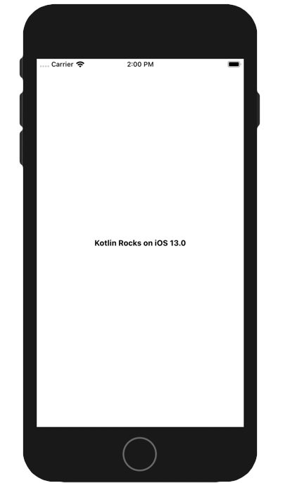

author: Maxime LUMEAU, Robin CAROFF and Pierre TIBULLE
summary: Kotlin Multiplatform Workshop
id: codelab-kotlin-multiplatform
categories: codelab,kotlin
environments: Web
status: Draft
feedback link: https://github.com/RobinCaroff/workshop-kmp
analytics account: ???

# Workshop Kotlin Multiplatform

## STEP ONE - CodeLab Overview and Settings
Duration: 0:16:00

### Sharing Kotlin code between iOS and Android 

In this codelab you will create an iOS and Android application, by making use of Kotlin's code sharing features. 
For Android you'll be using Kotlin/JVM, while for iOS it will be Kotlin/Native.

This codelab will show you the ability to share code within Kotlin and the benefits it provides. While what we'll be looking at is a simplified application, what is shown here can be applied to real world applications, independent of their size or complexity.

You will learn how to:

#### Create an Android app with Android Studio
#### Create a shared Kotlin library
* Use it from Android app
* Start the Android application

#### Create an iOS app with Xcode
* Use the shared Kotlin library from iOS app
* Use Kotlin from Swift
* Start the iOS application

#### Improve the shared library
* Use Coroutines to validate the asynchronous ability
* Use the multiplatform Http client Ktor to call a Json Api 

Positive
: This codelab is inspired by the Jetbrains [tutorial](https://kotlinlang.org/docs/tutorials/native/mpp-ios-android.html) for the first steps. The jetbrains codelab is more detailled on the initial configuration of the project and has very interesting focus on the gradle files. 

### Environment Setup

You need [Android Studio](https://developer.android.com/studio/) 3.4+ for the Android part of the tutorial. 

Negative
: ⚠️ Kotlin MPP is broken with 3.5.1. Please update to 3.5.3+ ⚠️

Positive
: You can also use [IntelliJ IDEA](https://jetbrains.com/idea/) Community or Ultimate edition.

The Kotlin plugin 1.3.41 or higher should be installed in the IDE. This can be verified via Language & Frameworks | Kotlin Updates section in the Settings (or Preferences) window.

For the iOS part of the tutorial, you need a macOS 10.14+ host with Xcode 10.3+ and the tools installed and configured.

Negative
: If you don't fill in the requirements at least for the Android part, please consider pair programming !!!

### Initialize the project

#### Let's check that everything is well configured !

Clone the workshop project repository : 
``` bash
git clone https://github.com/mlumeau/workshop-kmp.git
```

Checkout the branch `step_one_setup` : 
``` bash
cd workshop-kmp
git checkout step_one_setup
```

This project contain an Android app, a library and an iOS project.

#### Launch the Android Studio IDE and open the project.

The project should sync and you should be able to compile and run the Android application on an emulator or a real device. 

#### Let's check that it works!
You should see a blank screen :


Positive
: In the project, you can see the kore module which will contain the code for the multiplatform Android/iOS library.

#### For Mac users :
First you have to prepare the framework for iOS

``` bash
./gradlew :kore:packForXCode 
```

It creates the directory `kore/build/xcode-frameworks` which contains a gradlew executable and the framework for Xcode.

#### Now you can open the project in Xcode
by opening the workspace file : `../workshop-kmp/iosApp/kosmos/kosmos.xcworkspace`

You can now compile and run the project on an iOS emulator or on a real device.

You should see a blank screen :


#### If everything's fine, let's go to the second step !!!

## STEP TWO - A very basic KMP project
Duration: 0:12:00

#### In this step, you will implement your first multiplatform code !

The goal of this step is to define a common method which creates a greetings text and adds spécific implementations for iOS and Android in the Kotlin common code.

As a result, we will creates an Android module and an iOS framework both exposing the same method `createApplicationScreenMessage` but having different implementation.

Positive
: You may have to switch the type of View in the Android Studio Explorer during the codelab :
**Project** View for editing the Kore Library
**Android** View for editing the Android App

First add this code in the common directory of the kore library : `kore/src/commonMain/kotlin/xyz/mlumeau/kosmos/kore/common.kt`
IMPORTANT : Don't forget to switch to the **Project** View !!!

``` Kotlin
package xyz.mlumeau.kosmos.kore

expect fun platformName(): String

fun createApplicationScreenMessage(): String {
    return "Kotlin Rocks on ${platformName()}"
}
```

Positive
: The keyword `expect` means that you have to implement these function in the specific code (the `actual` code).

Now edit the android directory : `workshop-kmp/kore/src/androidMain/kotlin/xyz/mlumeau/kosmos/kore/actual.kt`

``` Kotlin
package xyz.mlumeau.kosmos.kore

actual fun platformName(): String {
    return "Android"
}
```

Positive
: The keyword `actual` corresponds to the `expect` in the specific code.

In the Android main project "androidApp", update the MainActivity :

Add a TextView in `res/layout/activity_main.xml`

``` XML
<?xml version="1.0" encoding="utf-8"?>

<RelativeLayout xmlns:android="http://schemas.android.com/apk/res/android"
        xmlns:tools="http://schemas.android.com/tools"
        android:layout_width="match_parent"
        android:layout_height="match_parent"
        tools:context=".views.MainActivity">

    <TextView
            android:id="@+id/title_tv"
            android:textStyle="bold"
            android:layout_width="wrap_content"
            android:layout_height="wrap_content"
            android:layout_centerInParent="true" />

</RelativeLayout>
```

Handle this textview in `java/xyz.mlumeau.kosmos.views/MainActivity` (Kotlin file)

``` Kotlin
package xyz.mlumeau.kosmos.views

import android.os.Bundle
import androidx.appcompat.app.AppCompatActivity
import kotlinx.android.synthetic.main.activity_main.*
import xyz.mlumeau.kosmos.R
import xyz.mlumeau.kosmos.kore.createApplicationScreenMessage

class MainActivity : AppCompatActivity() {

    override fun onCreate(savedInstanceState: Bundle?) {
        super.onCreate(savedInstanceState)
        setContentView(R.layout.activity_main)
        title_tv.text = createApplicationScreenMessage()
    }
}
```

Run it and you should see :


Now edit the iOS directory : `workshop-kmp/kore/src/iosMain/kotlin/xyz/mlumeau/kosmos/kore/actual.kt`

``` Kotlin
package xyz.mlumeau.kosmos.kore

import platform.UIKit.UIDevice

actual fun platformName(): String {
    return UIDevice.currentDevice.systemName() +
            " " +
            UIDevice.currentDevice.systemVersion
}
```

Positive
: You can notice the warning has now disapeared from the common file because the two targets iOS and Android has an "actual" for the "expect" !

#### For Mac users :

Back to Xcode !

If you are familiar with Storyboard, add a "titleTV" TextView in the center of the MainView and set the reference to the MainViewController.titleTV @IBOutlet.
If you prefer, download the [storyboard from the next step](https://github.com/mlumeau/workshop-kmp/blob/step_three_localrepository/iosApp/kosmos/kosmos/Base.lproj/Main.storyboard).

And then update the MainViewController to handle the "titleTV" textView

``` Swift
import UIKit
import Nuke
import kore

class MainViewController: UIViewController {
    
    @IBOutlet weak var titleTV: UITextView!
    
    override func viewDidLoad() {
        super.viewDidLoad()
        self.titleTV.text = CommonKt.createApplicationScreenMessage()
    }

    override var preferredStatusBarStyle: UIStatusBarStyle {
        return self.style
    }
    var style:UIStatusBarStyle = .default
}

```

You can now compile and run the project on an iOS emulator or on a real device.


#### If everything's fine, let's go to the step 3 !!!

## STEP THREE - Local Repository
Duration: 0:20:00

#### In this step, you will implement a local repository to simulate a call to the Nasa API APOD - "Astronomy Picture Of the Day" !

First create a common Model : `kore/src/commonMain/kotlin/xyz/mlumeau/kosmos/kore/model/APOD.kt`

``` Kotlin
package xyz.mlumeau.kosmos.kore.model

import kotlinx.serialization.Serializable

@Serializable
data class APOD(
    val explanation: String? = null,
    val media_type: String? = null,
    val title : String? = null,
    val url: String? = null
)
```

Update the common file : `.../kore/common.kt` (You can remove the plaform example...)

``` Kotlin
package xyz.mlumeau.kosmos.kore

import kotlinx.coroutines.CoroutineDispatcher
import kotlinx.coroutines.CoroutineScope
import kotlinx.coroutines.Job
import kotlin.coroutines.CoroutineContext

internal expect val coroutineScope: CoroutineScope

internal abstract class Scope(
    private val dispatcher: CoroutineDispatcher
) : CoroutineScope {
    private val job = Job()

    override val coroutineContext: CoroutineContext
        get() = dispatcher + job
}
```

Positive
: The `Coroutines` are supported differently on Android (kotlin) and iOS (Swift). As we are going to take advantage of coroutines, the Android and the iOS parts of the kore library will implement different solution.

Now create the repository cache interface : `.../kore/data/APODRepositoryCache.kt`

``` Kotlin
package xyz.mlumeau.kosmos.kore.data

import xyz.mlumeau.kosmos.kore.model.APOD

interface APODRepositoryCache {
    fun getAPOD(completion: (APOD) -> Unit, failure: () -> Unit)
}
```

And finally the repository cache implementation : `.../kore/data/APODRepositoryCacheImpl.kt` which contains the APOD stub in its companion object.

``` Kotlin
package xyz.mlumeau.kosmos.kore.data

import kotlinx.coroutines.launch
import kotlinx.serialization.json.Json
import xyz.mlumeau.kosmos.kore.coroutineScope
import xyz.mlumeau.kosmos.kore.model.APOD

class APODRepositoryCacheImpl : APODRepositoryCache {

    private suspend fun getAPOD(): APOD? = Json.nonstrict.parse(APOD.serializer(), APOD_STUB)

    override fun getAPOD(completion: (APOD) -> Unit, failure: () -> Unit) {
        coroutineScope.launch {
            var apod: APOD? = null
            try {
                apod = getAPOD()
            } catch (e: Exception) {
                println(e.message)
            }

            if (apod != null) {
                completion(apod)
            } else {
                failure()
            }
        }
    }

    companion object {
        private const val APOD_STUB =
            "{\"date\":\"2019-08-31\",\"explanation\":\"Few cosmic vistas excite the imagination like the Orion Nebula, an immense stellar nursery some 1,500 light-years away. Spanning about 40 light-years across the region, this infrared image from the Spitzer Space Telescope was constructed from data intended to monitor the brightness of the nebula's young stars, many still surrounded by dusty, planet-forming disks. Orion's young stars are only about 1 million years old, compared to the Sun's age of 4.6 billion years. The region's hottest stars are found in the Trapezium Cluster, the brightest cluster near picture center. Launched into orbit around the Sun on August 25, 2003 Spitzer's liquid helium coolant ran out in May 2009. The infrared space telescope continues to operate though, its mission scheduled to end on January 30, 2020. Recorded in 2010, this false color view is from two channels that still remain sensitive to infrared light at Spitzer's warmer operating temperatures.\",\"hdurl\":\"https://apod.nasa.gov/apod/image/1908/orion2010_spitzer.jpg\",\"media_type\":\"image\",\"service_version\":\"v1\",\"title\":\"Spitzer's Orion\",\"url\":\"https://apod.nasa.gov/apod/image/1908/orion2010_spitzerMedRC.jpg\"}"
    }
}
```

You have complete the common part of the kore library !

Now edit the android part of the kore library : `workshop-kmp/kore/src/androidMain/kotlin/xyz/mlumeau/kosmos/kore/actual.kt`

``` Kotlin
package xyz.mlumeau.kosmos.kore

import kotlinx.coroutines.CoroutineScope
import kotlinx.coroutines.Dispatchers

internal actual val coroutineScope = IOScope() as CoroutineScope

internal class IOScope : Scope(Dispatchers.IO) 
```

Positive
: The `Coroutine` implementation for Android is basic.


Now that we have a data model and a repository to provide it, we will create the user interface to display the data content.

Let's start with the Android application. In the Android main project "androidApp", update the MainActivity :

Remove the TextView and add an Image, a title, a text and a progressbar in `res/layout/activity_main.xml`

``` XML
<?xml version="1.0" encoding="utf-8"?>

<RelativeLayout
        xmlns:android="http://schemas.android.com/apk/res/android"
        xmlns:tools="http://schemas.android.com/tools"
        xmlns:app="http://schemas.android.com/apk/res-auto"
        android:layout_width="match_parent"
        android:layout_height="match_parent"
        tools:context=".views.MainActivity">
    <ScrollView android:layout_width="match_parent" android:layout_height="wrap_content">
        <androidx.constraintlayout.widget.ConstraintLayout
                android:layout_width="match_parent"
                android:layout_height="wrap_content"
                android:paddingBottom="16dp">

            <ImageView android:id="@+id/apod_iv"
                       android:layout_width="match_parent"
                       android:layout_height="0dp"
                       android:scaleType="centerCrop"
                       app:layout_constraintDimensionRatio="1:1"
                       app:layout_constraintTop_toTopOf="parent"
                       android:contentDescription="@string/astronomy_picture_of_the_day"/>

            <TextView
                    android:id="@+id/title_tv"
                    android:textStyle="bold"
                    android:layout_width="wrap_content"
                    android:layout_height="wrap_content"
                    app:layout_constraintLeft_toLeftOf="parent"
                    app:layout_constraintRight_toRightOf="parent"
                    android:layout_marginTop="32dp" app:layout_constraintTop_toBottomOf="@+id/apod_iv"
                    android:layout_marginLeft="16dp" android:layout_marginRight="16dp"/>
            <TextView
                    android:id="@+id/desc_tv"
                    android:layout_width="0dp"
                    android:layout_height="wrap_content"
                    android:ellipsize="end"
                    app:layout_constraintLeft_toLeftOf="parent"
                    app:layout_constraintRight_toRightOf="parent"
                    app:layout_constraintStart_toStartOf="parent" android:layout_marginStart="16dp"
                    app:layout_constraintEnd_toEndOf="parent" android:layout_marginEnd="16dp"
                    android:layout_marginTop="16dp"
                    app:layout_constraintTop_toBottomOf="@+id/title_tv"/>

        </androidx.constraintlayout.widget.ConstraintLayout>
    </ScrollView>

    <ProgressBar
            android:id="@+id/progress"
            android:indeterminate="true"
            android:layout_width="wrap_content" android:layout_height="wrap_content"
            app:layout_constraintEnd_toEndOf="parent" android:layout_marginEnd="8dp"
            android:layout_centerInParent="true"
            />

</RelativeLayout>
```

Handle these views in `java/xyz.mlumeau.kosmos.views/MainActivity` (Kotlin file)

``` Kotlin
package xyz.mlumeau.kosmos.views

import android.os.Bundle
import android.view.View
import androidx.appcompat.app.AppCompatActivity
import com.squareup.picasso.Picasso
import kotlinx.android.synthetic.main.activity_main.*
import kotlinx.coroutines.*
import xyz.mlumeau.kosmos.R
import xyz.mlumeau.kosmos.kore.model.APOD
import xyz.mlumeau.kosmos.kore.data.APODRepositoryCache
import xyz.mlumeau.kosmos.kore.data.APODRepositoryCacheImpl

class MainActivity : AppCompatActivity(), CoroutineScope by MainScope() {

    private val apodRepository: APODRepositoryCache = APODRepositoryCacheImpl()

    override fun onCreate(savedInstanceState: Bundle?) {
        super.onCreate(savedInstanceState)
        setContentView(R.layout.activity_main)

        getAPOD()
    }

    private fun updateAPODData(apod: APOD) {
        runOnUiThread {
            title_tv.text = apod.title
            desc_tv.text = apod.explanation
            if (apod.media_type == "image" && !apod.url.isNullOrEmpty()) {
                Picasso.get().load(apod.url).fit().centerCrop().into(apod_iv)
            } else {
                apod_iv.visibility = View.GONE
            }
            progress.visibility = View.GONE
        }
    }

    private fun getAPOD() {
        apodRepository.getAPOD(
            this::updateAPODData,
            this::onAPODLoadingError
        )
    }

    private fun onAPODLoadingError() {
        // Handle the error
    }
}
```

Run it and you should see :


Now edit the iOS part of the library : `workshop-kmp/kore/src/iosMain/kotlin/xyz/mlumeau/kosmos/kore/actual.kt`

``` Kotlin
package xyz.mlumeau.kosmos.kore

import kotlinx.coroutines.CoroutineDispatcher
import kotlinx.coroutines.CoroutineScope
import kotlinx.coroutines.Runnable
import platform.darwin.dispatch_async
import platform.darwin.dispatch_get_main_queue
import kotlin.coroutines.CoroutineContext

internal class MainDispatcher : CoroutineDispatcher() {
    override fun dispatch(context: CoroutineContext, block: Runnable) {
        dispatch_async(dispatch_get_main_queue()) {
            block.run()
        }
    }
}

internal class MainScope : Scope(MainDispatcher())

internal actual val coroutineScope = MainScope() as CoroutineScope 
```

Positive
: On iOS, we need to create a dispatcher that will handle our coroutine on the main dispatch queue. Notice that we use the dispatch_async() and dispatch_get_main_queue() functions that should sound familiar if you have worked with the Grand Central Dispatch on iOS before.  

#### For Mac users :

Back to Xcode ! We will now create the user interface for the iOS application.

If you are familiar with Storyboard, add the progressbar, UIImageView and another textview for description in the MainView (see picture below) and add references to the MainViewController.

If you prefer, download the [storyboard from the next step](https://github.com/mlumeau/workshop-kmp/blob/step_four_remoterepository/iosApp/kosmos/kosmos/Base.lproj/Main.storyboard).

And then update the `MainViewController` code...

``` Swift
import UIKit
import Nuke
import kore

class MainViewController: UIViewController {

    @IBOutlet weak var apodIV: UIImageView!
    @IBOutlet weak var titleTV: UITextView!
    @IBOutlet weak var descTV: UITextView!
    @IBOutlet weak var progress: UIActivityIndicatorView!
    
    private let apodRepository: APODRepositoryCache = APODRepositoryCacheImpl()
    
    override func viewDidLoad() {
        super.viewDidLoad()
        startLoadingData()
    }
    
    override var preferredStatusBarStyle: UIStatusBarStyle {
        return self.style
    }
    var style:UIStatusBarStyle = .default

}

private extension MainViewController {
    
    private func startLoadingData() {
        apodRepository.getAPOD(completion: { apod in
            self.updateAPODData(apod: apod)
        }, failure: { () in
            self.onLoadingError()
        })
    }
    
    func updateAPODData(apod: APOD) {
        self.progress.isHidden = true
        
        titleTV.text = apod.title
        descTV.text = apod.explanation
        
        if(apod.media_type == "image") {
            if let imageURL = apod.url, let url = URL(string: imageURL) {
                Nuke.loadImage(with: url, into: self.apodIV)
            }
        } else {
            apodIV.removeFromSuperview()
        }
    }
    
    func onLoadingError() {}
}
```

You can now compile and run the project on an iOS emulator or on a real device.


#### If everything's fine, let's go to the step 4 !!!

## STEP FOUR - Call the remote API
Duration: 0:15:00

#### In this step, you will implement a remote repository to call the Nasa API APOD - "Astronomy Picture Of the Day" !
First create the Nasa API service interface : `.../kore/service/nasa/NasaApi.kt`

``` Kotlin
package xyz.mlumeau.kosmos.kore.service.nasa

import xyz.mlumeau.kosmos.kore.model.APOD

internal interface NasaApi {
    suspend fun getAPOD(): APOD?
}
```

And the implementation : `.../kore/service/nasa/NasaApiRemote.kt`

``` Kotlin
package xyz.mlumeau.kosmos.kore.service.nasa

import io.ktor.client.HttpClient
import io.ktor.client.request.get
import io.ktor.client.statement.HttpResponse
import io.ktor.client.statement.readText
import kotlinx.serialization.json.Json
import xyz.mlumeau.kosmos.kore.model.APOD


internal class NasaAPIRemote(
    private val client: HttpClient = HttpClient()
) : NasaApi {

    private suspend fun request(urlString: String): String {
        return client.get<HttpResponse>(urlString).readText()
    }

    private suspend fun requestAPOD() : APOD {
        val result = request(APOD_URL)

        return Json.nonstrict.parse(APOD.serializer(), result)
    }

    override suspend fun getAPOD(): APOD = requestAPOD()

    companion object {
        const val APOD_URL = "https://api.nasa.gov/planetary/apod?&api_key=DEMO_KEY"
    }
}
```

Now create the remote repository interface : `.../kore/data/APODRepositoryRemote.kt`

``` Kotlin
package xyz.mlumeau.kosmos.kore.data

import xyz.mlumeau.kosmos.kore.model.APOD

interface APODRepositoryRemote {
    fun getAPOD(completion: (APOD) -> Unit, failure: () -> Unit)
}
```

And the implementation : `.../kore/data/APODRepositoryRemoteImpl.kt`

``` Kotlin
package xyz.mlumeau.kosmos.kore.data

import kotlinx.coroutines.launch
import xyz.mlumeau.kosmos.kore.coroutineScope
import xyz.mlumeau.kosmos.kore.model.APOD
import xyz.mlumeau.kosmos.kore.service.nasa.NasaAPIRemote
import xyz.mlumeau.kosmos.kore.service.nasa.NasaApi

class APODRepositoryRemoteImpl : APODRepositoryRemote {
    private val nasaAPI: NasaApi = NasaAPIRemote()

    private suspend fun getAPOD() = nasaAPI.getAPOD()

    override fun getAPOD(completion: (APOD) -> Unit, failure: () -> Unit) {
        coroutineScope.launch {
            var apod: APOD? = null
            try {
                apod = getAPOD()
            } catch (e: Exception) {
                println(e.message)
            }

            if (apod != null) {
                completion(apod)
            } else {
                failure()
            }
        }
    }
}
```

In the Android main project "androidApp", update the `java/xyz.mlumeau.kosmos.views/MainActivity` (Kotlin file) by replacing the Cache repository with Remote Repository :

``` Kotlin
...
import xyz.mlumeau.kosmos.kore.data.APODRepositoryRemote
import xyz.mlumeau.kosmos.kore.data.APODRepositoryRemoteImpl

class MainActivity : AppCompatActivity() {

    private val apodRepository: APODRepositoryRemote = APODRepositoryRemoteImpl()
...
```

Run it and you should see a new picture : the Astronomy picture of the day !

Negative
: No picture ? It is a video day ! Call the API with a specific date parameter in the : `.../kore/service/nasa/NasaApiRemote.kt`

``` Kotlin
const val APOD_URL = "https://api.nasa.gov/planetary/apod?&api_key=DEMO_KEY&date=2019-10-20"
```

Take some time to celebrate 🎉!!!

#### For Mac users :

Back to Xcode !

Update the `MainViewController` code by replacing the Cache Repository by a Remote Repository :

``` Swift
...
class MainViewController: UIViewController {

    ...
    private let apodRepository: APODRepositoryRemote = APODRepositoryRemoteImpl()
 
```

You can now compile and run the project on an iOS emulator or on a real device to see the new picture of the day !
iOS celebration time 🥳!!!

#### If everything's fine, let's go to the step 5 !!!

## STEP FIVE - Architecture
Duration: 0:12:00

#### In this step, you will implement a better architecture in native apps !

Negative
: If you're in a hurry, you can skip this step and go directly to [Step 6](/codelab-kotlin-multiplatform/#7). 😉

Nothing to do in the Kore library this time !

In the Android main project "androidApp", create a viewmodels directory.

Add a new class APOD view model : `.../viewmodels/APODViewModel.kt`

``` Kotlin
package xyz.mlumeau.kosmos.viewmodels

import androidx.lifecycle.LiveData
import androidx.lifecycle.MutableLiveData
import androidx.lifecycle.ViewModel
import xyz.mlumeau.kosmos.kore.data.APODRepositoryRemote
import xyz.mlumeau.kosmos.kore.model.APOD

class APODViewModel(
    private val apodRepository: APODRepositoryRemote
) : ViewModel() {

    private val _apod = MutableLiveData<APOD>()
    val apod: LiveData<APOD>
        get() = _apod

    init {
        startLoadingData()
    }

    private fun startLoadingData() {
         apodRepository.getAPOD(
            this::onAPODLoaded,
            this::onAPODLoadingError
        )
    }

    private fun onAPODLoaded(apod: APOD) {
        _apod.postValue(apod)
    }

    private fun onAPODLoadingError() {
        // Handle the error
    }
}
```

Add a factory : `.../viewmodels/APODViewModelFactory.kt`

``` Kotlin
package xyz.mlumeau.kosmos.viewmodels

import androidx.lifecycle.ViewModel
import androidx.lifecycle.ViewModelProvider
import xyz.mlumeau.kosmos.kore.data.APODRepositoryRemoteImpl

class APODViewModelFactory : ViewModelProvider.Factory {

    @Suppress("UNCHECKED_CAST")
    override fun <T : ViewModel> create(modelClass: Class<T>): T {
        require(modelClass == APODViewModel::class.java) { "Unknown ViewModel class" }
        return APODViewModel(
            APODRepositoryRemoteImpl()
        ) as T
    }
}
```

update the `java/xyz.mlumeau.kosmos.views/MainActivity` (Kotlin file) by replacing the getApod() function with a call to the ViewModel  :

``` Kotlin
...
import androidx.lifecycle.Observer
import androidx.lifecycle.ViewModelProvider
import xyz.mlumeau.kosmos.viewmodels.APODViewModel
import xyz.mlumeau.kosmos.viewmodels.APODViewModelFactory

class MainActivity : AppCompatActivity() {

    override fun onCreate(savedInstanceState: Bundle?) {
        super.onCreate(savedInstanceState)
        setContentView(R.layout.activity_main)
        
        // getApod()
        val model = ViewModelProvider(this, APODViewModelFactory())[APODViewModel::class.java]
        model.apod.observe(this, Observer { apod -> updateAPODData(apod) })
    }
```
The function getApod() can be removed.

Run it to validate the new architecture.

#### For Mac users :

Back to Xcode !

Create a ViewModels directory.

Add a new class : `.../ViewModels/MainViewModel`

``` Swift
import Foundation
import kore

final class MainViewModel {
    private let apodRepository: APODRepositoryRemote = APODRepositoryRemoteImpl()
    var apod: APOD? = nil
    var onAPODLoaded: ((APOD) -> ())? = nil
    var onLoadingError: (() -> ())? = nil
    
    init() {
        startLoadingData()
    }
    
    private func startLoadingData() {
        apodRepository.getAPOD(completion: { apod in
            self.apod = apod
            self.onAPODLoaded?(apod)
        }, failure: { () in
            self.onLoadingError?()
        })
    }
}
```

Update the `MainViewController` code by replacing the Repository by the View Model :

``` Swift
...
    // private let apodRepository: APODRepositoryRemote = APODRepositoryRemoteImpl()
    let viewModel = MainViewModel()

    override func viewDidLoad() {
        super.viewDidLoad()
        // startLoadingData()
        configureUI()
        configureBinding()
    }
 
 ...

 private extension MainViewController {
    
//    private func startLoadingData() {
//        apodRepository.getAPOD(completion: { apod in
//            self.updateAPODData(apod: apod)
//            return .init()
//        }, failure: { () in
//            self.onLoadingError()
//            return .init()
//        })
//    }
    func configureUI() {
    }
    
    func configureBinding() {
        viewModel.onAPODLoaded = updateAPODData
        viewModel.onLoadingError = onLoadingError
    }
...
```

You can now compile and run the project to validate the architecture updates !

#### If everything's fine, let's go to the step 6 !!!

## STEP SIX - A dedicated Use Case
Duration: 0:15:00

#### In this step, you will implement a dedicated use case for retrieving the APOD data in the Kore Library !

To follow up with on the previous step and follow the single responsability principle, we will create a use case to retrieve APOD data. The main goal is to abstract the logic behind this operation. No needs for the final app to know how the data will be retrieved.

Positive
: The `GetAPOD` use case will handle the logic of choosing between the remote and the cache repository based on whether or not an internet connection is available. 

First create a usecase GetAPOD : `.../kore/usecases/GetAPOD.kt`

``` Kotlin
package xyz.mlumeau.kosmos.kore.usecases

import xyz.mlumeau.kosmos.kore.model.APOD

interface GetAPOD {
    fun getAPOD(completion: (APOD) -> Unit, failure: () -> Unit)
}
```

, a usecase GetConnectionState : `.../kore/usecases/GetConnectionState.kt`

``` Kotlin
package xyz.mlumeau.kosmos.kore.usecases

interface GetConnectionState {
    fun isConnectedToNetwork(): Boolean
}
```

and the GetAPOD implementation : `.../kore/usecases/implementations/GetAPODImpl.kt`

``` Kotlin
package xyz.mlumeau.kosmos.kore.usecases.implementations

import kotlinx.coroutines.launch
import xyz.mlumeau.kosmos.kore.coroutineScope
import xyz.mlumeau.kosmos.kore.data.APODRepositoryCache
import xyz.mlumeau.kosmos.kore.data.APODRepositoryCacheImpl
import xyz.mlumeau.kosmos.kore.data.APODRepositoryRemote
import xyz.mlumeau.kosmos.kore.data.APODRepositoryRemoteImpl
import xyz.mlumeau.kosmos.kore.model.APOD
import xyz.mlumeau.kosmos.kore.usecases.GetAPOD
import xyz.mlumeau.kosmos.kore.usecases.GetConnectionState

class GetAPODImpl(private val getConnectionState: GetConnectionState) : GetAPOD {

    private val apodRepositoryCache: APODRepositoryCache = APODRepositoryCacheImpl()
    private val apodRepositoryRemote: APODRepositoryRemote = APODRepositoryRemoteImpl()

    private suspend fun getAPOD() = if (getConnectionState.isConnectedToNetwork()) {
        apodRepositoryRemote.getAPOD()
    } else {
        apodRepositoryCache.getAPOD()
    }

    override fun getAPOD(completion: (APOD) -> Unit, failure: () -> Unit) {
        coroutineScope.launch {
            var apod: APOD? = null
            try {
                apod = getAPOD()
            } catch (e: Exception) {
                println(e.message)
            }

            if (apod != null) {
                completion(apod)
            } else {
                failure()
            }
        }
    }
}
```

Now update the repository interfaces to replace the getAPOD with params function by a suspend function : `kore/data/APODRepositoryCache.kt` and `kore/data/APODRepositoryRemote.kt`

``` Kotlin
// fun getAPOD(completion: (APOD) -> Unit, failure: () -> Unit)
    suspend fun getAPOD(): APOD?
```

Update the cache implementation `kore/data/APODRepositoryCacheImpl.kt` by deleting the getAPOD with param function and transform the suspend function from private to override :

``` Kotlin
    override suspend fun getAPOD(): APOD? = Json.nonstrict.parse(APOD.serializer(), APOD_STUB)

    // override fun getAPOD(completion: (APOD) -> Unit, failure: () -> Unit) {
    // ...
```

Do the same in the remote implementation `kore/data/APODRepositoryRemoteImpl.kt` :

``` Kotlin
    override suspend fun getAPOD() = nasaAPI.getAPOD()

    // override fun getAPOD(completion: (APOD) -> Unit, failure: () -> Unit) {
    // ...
```

In the Android main project "androidApp", 

Add a usecase : `.../usecases/GetConnectionStateAndroid.kt`

``` Kotlin
package xyz.mlumeau.kosmos.usecases

import android.net.ConnectivityManager
import android.net.NetworkInfo
import xyz.mlumeau.kosmos.kore.usecases.GetConnectionState

class GetConnectionStateAndroid(
    private val connectivityManager: ConnectivityManager
) : GetConnectionState {
    override fun isConnectedToNetwork(): Boolean {
        val activeNetwork: NetworkInfo? = connectivityManager.activeNetworkInfo
        return activeNetwork?.isConnected == true
    }
}
```

Update the viewmodel : `.../viewmodels/APODViewModel.kt`

``` Kotlin
...
// import xyz.mlumeau.kosmos.kore.data.APODRepositoryRemote
import xyz.mlumeau.kosmos.kore.usecases.GetAPOD

class APODViewModel(
    // private val apodRepository: APODRepositoryRemote
    private val getApodUseCase: GetAPOD
) : ViewModel() {

    ...

    private fun startLoadingData() {
        getApodUseCase.getAPOD(
            this::onAPODLoaded,
            this::onAPODLoadingError
        )
    }
}
```

And the factory : `.../viewmodels/APODViewModelFactory.kt`

``` Kotlin
package xyz.mlumeau.kosmos.viewmodels

import android.content.Context
import android.net.ConnectivityManager
import androidx.lifecycle.ViewModel
import androidx.lifecycle.ViewModelProvider
import xyz.mlumeau.kosmos.kore.usecases.GetConnectionState
import xyz.mlumeau.kosmos.kore.usecases.implementations.GetAPODImpl
import xyz.mlumeau.kosmos.usecases.GetConnectionStateAndroid

class APODViewModelFactory(
    private val context: Context
) : ViewModelProvider.Factory {

    @Suppress("UNCHECKED_CAST")
    override fun <T : ViewModel> create(modelClass: Class<T>): T {
        require(modelClass == APODViewModel::class.java) { "Unknown ViewModel class" }
        val connectivityManager =
            context.getSystemService(Context.CONNECTIVITY_SERVICE) as ConnectivityManager
        val getConnectionState: GetConnectionState = GetConnectionStateAndroid(connectivityManager)
        return APODViewModel(
            GetAPODImpl(getConnectionState)
        ) as T
    }
}
```

Update the `java/xyz.mlumeau.kosmos.views/MainActivity` (Kotlin file) to add a context parameter in the factory constructor :

``` Kotlin
...
    val model = ViewModelProvider(this, APODViewModelFactory(this))[APODViewModel::class.java]
...
```

Everything's fine ???

#### For Mac users :

Back to Xcode !

Add a usecase : `.../UseCases/GetConnectionStateIos`

``` Swift
import UIKit
import SystemConfiguration
import kore

class GetConnectionStateIos: NSObject, GetConnectionState {
    func isConnectedToNetwork() -> Bool {
        var zeroAddress = sockaddr_in(sin_len: 0, sin_family: 0, sin_port: 0, sin_addr: in_addr(s_addr: 0), sin_zero: (0, 0, 0, 0, 0, 0, 0, 0))
        zeroAddress.sin_len = UInt8(MemoryLayout.size(ofValue: zeroAddress))
        zeroAddress.sin_family = sa_family_t(AF_INET)
        
        let defaultRouteReachability = withUnsafePointer(to: &zeroAddress) {
            $0.withMemoryRebound(to: sockaddr.self, capacity: 1) {zeroSockAddress in
                SCNetworkReachabilityCreateWithAddress(nil, zeroSockAddress)
            }
        }
        
        var flags: SCNetworkReachabilityFlags = SCNetworkReachabilityFlags(rawValue: 0)
        if SCNetworkReachabilityGetFlags(defaultRouteReachability!, &flags) == false {
            return false
        }
        
        /* Only Working for WIFI
         let isReachable = flags == .reachable
         let needsConnection = flags == .connectionRequired
         
         return isReachable && !needsConnection
         */
        
        // Working for Cellular and WIFI
        let isReachable = (flags.rawValue & UInt32(kSCNetworkFlagsReachable)) != 0
        let needsConnection = (flags.rawValue & UInt32(kSCNetworkFlagsConnectionRequired)) != 0
        let ret = (isReachable && !needsConnection)
        
        return ret
    }
}
```

Update the `MainViewModel` code by replacing the Repository by the use case :

``` Swift
...
final class MainViewModel {
    // private let apodRepository: APODRepositoryRemote = APODRepositoryRemoteImpl()
    private let getConnectionState: GetConnectionState = GetConnectionStateIos()
    private let getApodUseCase: GetAPOD
    ...
    
    init() {
        getApodUseCase = GetAPODImpl(getConnectionState: getConnectionState)
        startLoadingData()
    }
    
    private func startLoadingData() {
        // apodRepository.getAPOD(completion: { apod in
        getApodUseCase.getAPOD(completion: { apod in
            self.apod = apod
            self.onAPODLoaded?(apod)
        }, failure: { () in
            self.onLoadingError?()
        })
    }
}
```

You can now compile and run the project to validate the architecture updates !

#### If everything's fine, let's go to the step 7 !!!

## STEP SEVEN - Where to Go From Here?
Duration: 0:00:00

#### If you reach this step then you are in a very good position to start implementing your own Kotlin Multiplatform code!

Let's think about some improvements we can make to this app.

How about improving the `GetAPOD` use case with a cache management? New APOD data is available every day. Knowing this there is no point making multiple requests to the NASA's API during the same day. We could then have a cache system which stores the APOD data with an associated time. The `APODRepositoryCache` will then be able to serve this persisted data and provide information about its expiration. The `GetAPOD` use case will then be able to decide whether it should use the `APODRepositoryCache` if cached data is available and not expired or the `APODRepositoryRemote` to get fresh data.

Let's modify the `APODRepositoryCache` interface (`xyz.mlumeau.kosmos.kore.data.APODRepositoryCache`) and add two methods: 

``` Kotlin
package xyz.mlumeau.kosmos.kore.usecases

import xyz.mlumeau.kosmos.kore.model.APOD

interface APODRepositoryCache {
    suspend fun getAPOD(): APOD?
    fun setLastCacheTime(lastCache: Long)
    fun isProjectsCacheExpired(): Boolean
}
```

It's now your turn to create your own Kotlin Multiplatform code.

You should first update the implementation of the `APODRepositoryCache` interface (`APODRepositoryCacheImpl`) to provide persistence capabilites. You can either choose a plateform specific solution or use some Koltin Multiplatform compatible solution such as [SQLdelight](https://www.kotlinresources.com/library/sqldelight/).

Once you have your improved cache system working, you can then update the `GetAPOD` use case implementation (`GetAPODImpl`) to use those new capabilities.


Positive
: You reached the end of this workshop. Thank you very much for attending! We hope you enjoyed discovering this new technology. Keep us posted with your results, projects and discoveries about Kotlin Multiplatform. Have fun 🥳!