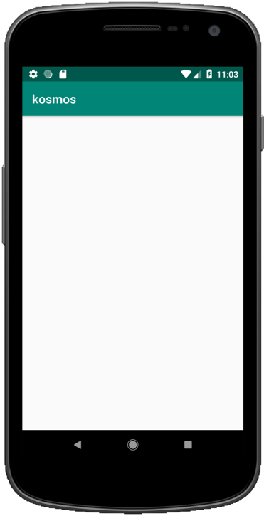

author: Maxime LUMEAU, Robin CAROFF and Pierre TIBULLE
summary: Kotlin Multiplatform Workshop Getting Started Guide
id: getting-started-codelab-kmp
categories: codelab,kotlin
environments: Web
status: Draft
feedback link: https://github.com/RobinCaroff/workshop-kmp
analytics account: ???

# Getting Started Guide for the Workshop Kotlin Multiplatform

## Environment Setup
Duration: 0:05:00

You need [Android Studio](https://developer.android.com/studio/) 3.4+ for the Android part of the tutorial. 

Negative
: ⚠️ Kotlin MPP is broken with 3.5.1. Please update to 3.5.3+ ⚠️

Positive
: You can also use [IntelliJ IDEA](https://jetbrains.com/idea/) Community or Ultimate edition.

The Kotlin plugin 1.3.41 or higher should be installed in the IDE. This can be verified via Language & Frameworks | Kotlin Updates section in the Settings (or Preferences) window.

Optionnal for mac user : For the iOS part of the tutorial, you need a macOS 10.14+ host with Xcode 10.3+ and the tools installed and configured.

## Initialize the project
Duration: 0:05:00

### Let's check that everything is well configured !

Clone the workshop project repository : 
``` bash
git clone https://github.com/mlumeau/workshop-kmp.git
```

Checkout the branch `step_one_setup` : 
``` bash
cd workshop-kmp
git checkout step_one_setup
```

This project contain an Android app, a library and an iOS project.

### Launch the Android Studio IDE and open the project.

The project should sync and you should be able to compile and run the Android application on an emulator or a real device. 

### Let's check that it works!
You should see a blank screen :


Positive
: You are ready to enjoy the android part of the workshop ! 

### For Mac users only (optionnal) :
First you have to prepare the framework for iOS

``` bash
./gradlew :kore:packForXCode 
```

It creates the directory `kore/build/xcode-frameworks` which contains a gradlew executable and the framework for Xcode.

### Now you can open the project in Xcode
by opening the workspace file : `../workshop-kmp/iosApp/kosmos/kosmos.xcworkspace`

You can now compile and run the project on an iOS emulator or on a real device.

You should see a blank screen :


Positive
: You are ready to enjoy the complete workshop (Android + iOS) !